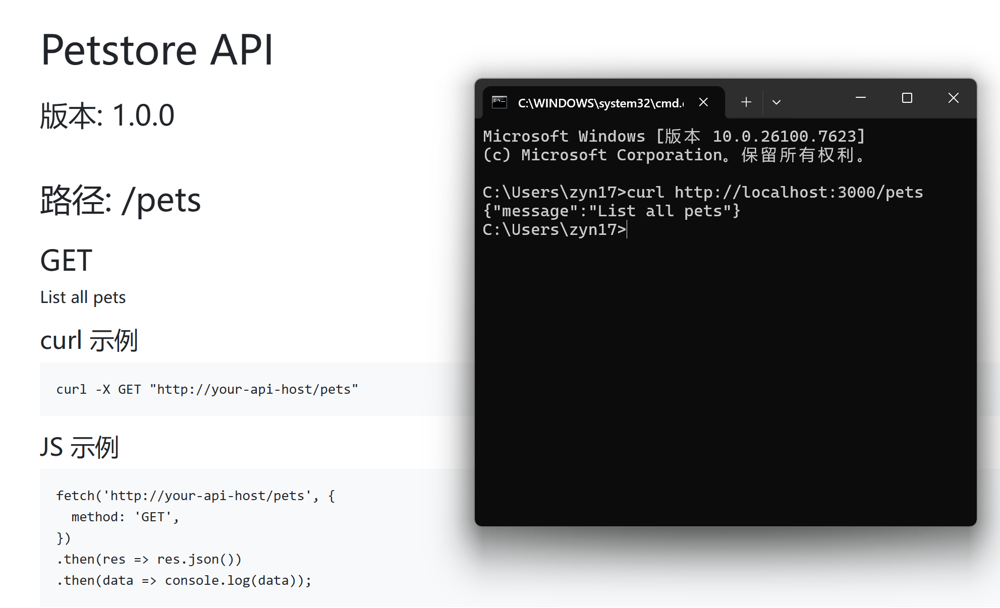

# API Doc AI

一键将 OpenAPI/Swagger 文件生成专业 API 文档，支持 AI 智能补描述、真实示例数据、自动校验和可运行 Demo 服务器。

**English below / 英文版在下方**

## 特性

- 🚀 **一键生成**：输入 OpenAPI JSON/YAML → 自动输出美观 HTML 文档
- 🤖 **AI 补描述**：自动生成人性化接口说明（规则驱动，增值版支持真实 AI）
- 📝 **真实示例**：使用 faker 生成逼真请求/响应数据
- 🔍 **自动校验**：检测缺失描述、无效 schema 等问题
- 💻 **调用示例**：自动生成 curl 和 JavaScript (fetch) 示例
- 🖥️ **可运行 Demo**：生成 Express 模拟服务器，立刻测试接口
- 🎨 **现代样式**：Bootstrap 美化，专业感十足

## 快速开始

```bash
# 1. 克隆仓库
git clone https://github.com/你的用户名/apidoc-ai.git
cd apidoc-ai

# 2. 安装依赖
npm install

# 3. 生成文档（使用示例文件）
node generateDocs.js -i apis/petstore.json -o dist

# 4. 查看文档
open dist/index.html   # 或直接在浏览器打开

# 5. 启动 Demo 服务器测试接口
node dist/demo-server.js
curl http://localhost:3000/pets

## 截图



*左：生成的 HTML 文档 | 右：真实 curl 测试 Demo 服务器响应*

API Doc AI (English)
One-click generate professional API documentation from OpenAPI/Swagger files, with AI-enhanced descriptions, realistic examples, validation, and runnable demo server.
Features

One-click HTML doc generation
AI-powered human-readable descriptions
Realistic request/response examples (powered by faker)
Automatic validation and issue reporting
curl & JavaScript examples
Runnable Express demo server
Beautiful Bootstrap styling

Quick Start
Same as above...
Pro Version Coming Soon

Real AI integration
Custom templates
Batch processing
Team collaboration links

Star & Watch for updates! ⭐
